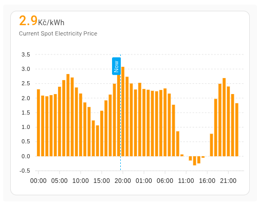

# Home Assistant Czech Energy Spot Prices

[](https://my.home-assistant.io/redirect/hacs_repository/?owner=rnovacek&repository=homeassistant_cz_energy_spot_prices&category=integration)

Home Assistant integration that provides current Czech electricity and gas spot prices based on [OTE](https://ote-cr.cz).

If this integration saves (or earns) you some money, you can [buy me a coffee ☕](https://github.com/sponsors/rnovacek).

## Features

- Provides real-time Czech electricity and gas spot prices from [OTE](https://ote-cr.cz).
- Supports both **60-minute** and **15-minute** electricity spot intervals (15-minute prices are available since OTE introduced them).
- Supports multiple currencies (EUR, CZK) and energy units (kWh, MWh).
- Configurable templates for buy/sell prices, including VAT and distribution fees.
- Includes sensors for monitoring current, cheapest, and most expensive electricity prices.
- Configurable binary sensors for the cheapest **consecutive hour blocks** in a day (e.g. cheapest 2, 4 or 8 hours in a row).
- Persists last downloaded prices across Home Assistant restarts so sensors are available immediately on startup.
- Compatible with Home Assistant automations for energy optimization.

### Multiple instances

You can add the integration multiple times to combine commodities and intervals, for example:

- one instance for 60-minute electricity spot prices,
- another instance for 15-minute electricity spot prices,
- another instance for gas spot prices.

Each instance is configured separately (currency, unit, buy/sell template, cheapest blocks).

### Important note

OTE (Czech market operator) uses hourly prices indexed from `1`, where:

- `1` (first hour of the day) corresponds to `00:00 - 01:00`.
- It does **not** mean `01:00 - 02:00`, as one might expect.

Keep this in mind when comparing prices reported by this integration with other sources (e.g., OTE, your electricity provider/distributor).

## Screenshot

See [Displaying a chart](#displaying-a-chart) for details.



## Buy and sell prices

The integration shows just spot prices by default. If you want to also use actual prices for buying and selling (so including distribution fees, VAT, etc), you need to configure it. Use the "Configure" button in integration details and set templates for buying/selling.

Variables for **electricity** templates:
- `value` — base spot price for the given interval (hourly or 15min, depending on configuration).
- `hour` — datetime of the interval being computed. The value is in **UTC**; if you need the local time (e.g. for tariff windows), use `as_local(hour)`.

Variables for **gas** templates (gas has only daily prices):
- `value` — base spot price for the day.
- `day` — date of the price (in UTC).

If you do not enter a template, the corresponding buy/sell sensors are not created.

### Example templates

**Electricity cost when buying**

```jinja










  


{{ (value + distrib_kWh + tax_kWh + oze_kWh + system_services_kWh + operator_cost_kWh) * ( 100.0 + vat_percent ) / 100.0 }}
```

**Electricity cost when selling**

```jinja

{{ value - operator_cost_kWh }}
```

**Gas cost when buying**

```jinja





{{ (value + distrib_kWh + tax_kWh + operator_cost_kWh) * (100.0 + vat_percent) / 100.0 }}
```

## Installation

You can install the integration using HACS (preferred) or manually.

### HACS (preferred)

1. Open HACS in your Home Assistant instance.
2. Search for "Czech Energy Spot Prices" and install it.
3. Restart Home Assistant.

### Manual

1. Download the `custom_components/cz_energy_spot_prices` directory.
2. Copy it into the `custom_components` folder in your Home Assistant configuration directory.
3. Restart Home Assistant.

### Add and configure the integration

1. Go to **Settings** -> **Devices & Services** -> **Add integration**.
2. Search for "Czech Energy Spot Prices" and select it.
3. Pick the **commodity** (electricity or gas), **currency** and **energy unit**. For electricity you will also be asked to choose the **interval** (60 minutes or 15 minutes).
4. (Optional) Use the "Configure" button to set templates for buy/sell prices (see above) and the list of cheapest consecutive hour blocks (see [Cheapest consecutive hour blocks](#cheapest-consecutive-hour-blocks)).
5. (Optional) Repeat the steps to add another instance for a different commodity or interval (see [Multiple instances](#multiple-instances)).

## Sensors

The integration provides several sensors to monitor electricity/gas prices and related data. Below is a list of available sensors and their attributes.

### Electricity sensors

When the 15-minute interval is selected, the same sensors are also created with the `_15min` suffix in their entity id (e.g. `sensor.current_spot_electricity_price_15min`).

| Sensor | value | attributes |
| ------ | ----- | ---------- |
| **Current Spot Electricity Price** | electricity price for current interval (hour or 15 minutes) | dictionary with timestamps as keys and spot price for given interval as values |
| **Spot Cheapest Electricity Today** | price of the cheapest electricity today | [At](#at)<br>[Hour](#hour) |
| **Spot Most Expensive Electricity Today** | price of the most expensive electricity today | [At](#at)<br>[Hour](#hour) |
| **Spot Cheapest Electricity Tomorrow** | price of the cheapest electricity tomorrow | [At](#at)<br>[Hour](#hour) |
| **Spot Most Expensive Electricity Tomorrow** | price of the most expensive electricity tomorrow | [At](#at)<br>[Hour](#hour) |
| **Current Spot Electricity Hour Order** | order of current interval when we sort intervals by their price (1=cheapest, N=most expensive; N=24 for hourly, 96 for 15min) | dictionary with timestamps as keys and `[order, price]` as values |
| **Tomorrow Spot Electricity Hour Order** | no value | dictionary with timestamps as keys and `[order, price]` as values |
| **Spot Electricity Has Tomorrow Data** | `On` when data for tomorrow are loaded, `Off` otherwise (created only once for all electricity instances) | |
| **Spot Electricity Is Cheapest** | `On` when current interval has the cheapest price of the day, `Off` otherwise | [Start](#start)<br>[Start hour](#start-hour)<br>[End](#end)<br>[End hour](#end-hour)<br>[Min](#min)<br>[Max](#max)<br>[Mean](#mean) |
| **Spot Electricity Is Cheapest `X` Hours Block** | `On` when current time falls inside the cheapest consecutive `X` hour block of the day, `Off` otherwise (one sensor per `X` configured in [Cheapest consecutive hour blocks](#cheapest-consecutive-hour-blocks)) | [Start](#start)<br>[Start hour](#start-hour)<br>[End](#end)<br>[End hour](#end-hour)<br>[Min](#min)<br>[Max](#max)<br>[Mean](#mean) |

If you configure templates for buy and sell prices, there will also be similar `Buy *` and `Sell *` sensors with the same structure.

### Gas sensors

Gas prices are published once per day, so gas sensors are simpler than the electricity ones.

| Sensor | value | attributes |
| ------ | ----- | ---------- |
| **Current Spot Gas Price** | gas spot price for today | |
| **Tomorrow Spot Gas Price** | gas spot price for tomorrow (when available) | |
| **Spot Gas Has Tomorrow Data** | `On` when tomorrow's gas price is loaded, `Off` otherwise (created only once for all gas instances) | |

If you configure a buy template for gas, there will also be `Current Buy Gas Price` and `Tomorrow Buy Gas Price` sensors. Selling is not supported for gas.

## Common attributes

### At

timestamp when the cheapest hour starts

### Hour

hour with the cheapest electricity (`2` means that cheapest electricity is from `2:00` till `3:00` in timezone you've configured in Home Assistant)

### Start

timestamp when consecutive block of cheapest hours starts, only available when the block is in the future

### Start hour

hour when consecutive block of cheapest hours starts, only available when the block is in the future

### End

timestamp when consecutive block of cheapest hours ends, only available when the block is in the future

### End hour

hour when consecutive block of cheapest hours ends, only available when the block is in the future

### Min

minimal price in the block, only available when the block is in the future

### Max

maximal price in the block, only available when the block is in the future

### Mean

average (mean) price in the block, only available when the block is in the future


## Cheapest consecutive hour blocks

In addition to the always-present *Spot Electricity Is Cheapest* binary sensor (which marks the single cheapest interval of the day), you can ask the integration to create binary sensors for the cheapest **consecutive** hour blocks of the day.

Open **Configure** on the integration card and fill the *Cheapest consecutive hour blocks* field with a comma-separated list of hour lengths, for example:

```
2, 4, 8
```

This creates three additional binary sensors:

- `binary_sensor.spot_electricity_is_cheapest_2_hours_block`
- `binary_sensor.spot_electricity_is_cheapest_4_hours_block`
- `binary_sensor.spot_electricity_is_cheapest_8_hours_block`

Each sensor turns `On` while the current time falls inside the cheapest contiguous window of the given length within today's prices. Equivalent `buy_*` and `sell_*` sensors are created when the corresponding templates are configured. Each block is computed within a single day (it does not span midnight).


## Displaying a chart


If you want to display a chart with current day (or two days if it's after noon), you can install [apexcharts-card](https://github.com/RomRider/apexcharts-card) card for Home Assistant and then use following config for it:

```yaml
type: custom:apexcharts-card
header:
  show: true
  show_states: true
  colorize_states: true
  title: Nákupní cena (15 min)
graph_span: 1d
span:
  start: day
now:
  show: true
  label: Nyní
  color: "#ff0000"
series:
  - entity: sensor.current_buy_electricity_price_15min
    name: Cena
    float_precision: 2
    type: line
    curve: stepline
    stroke_width: 2
    show:
      in_header: raw
    color_threshold:
      - value: -10
        color: "#00cc00"
      - value: 0
        color: "#ffaa00"
      - value: 4
        color: "#ff0000"
    data_generator: |
      return Object.entries(entity.attributes)
        .filter(([key, _]) => !isNaN(Date.parse(key)))
        .map(([date, value]) => {
          return [new Date(date).getTime(), value];
        });
```

## Find cheapest hours in selected interval

This is useful for example if you want to turn on your water heater in the afternoon and then again during the night.

### How It Works
- Define intervals as tuples `(start_hour, end_hour)` (end hour is excluded).
- The sensor will return `True` if the current hour is the cheapest in any of the defined intervals.
- Alternatively, replace the last line with `{{ min.cheapest_hours }}` to display the cheapest hours.

### Example Template Sensor

```jinja
{# Define your intervals here as tuples (hour starting the interval, hour ending the interval (excluded)) #}


{# We need to use namespace so we can write into it in inner cycle #}





  {# Reset min price from previous runs #}
  

  {# Go through all the hours in the interval (end excluded) and find the hour with lowest price #}
  
     {# Get datetime of current hour in current interval #}
     

     {# Get value for that hour #}
     

     {# Skip if not found #}
     
       
     

     {# value is tuple (order, price), we'll use the price #}
     

     {# Min price is not set or is higher than price of current hour => store the min price and hour #}
     
        
        
     
  

  {# Store cheapest hour in current interval #}
  


{# use this to get the cheapest hours #}
{# {{ min.cheapest_hours }} #}

{# return True if current hour is in the cheapest hour of any interval #}
{{ now().hour in min.cheapest_hours }}
```

## Example automation for X cheapest hours

This automation turns on a device (e.g., a heater) during the cheapest `X` hours of the day. Replace `X` with the desired number of hours and specify the entity to control.


```yaml
alias: Turn on for cheapest X hours
trigger:
  - platform: state
    entity_id:
      - sensor.current_spot_electricity_hour_order
condition: []
action:
  - if:
      - condition: numeric_state
        entity_id: sensor.current_spot_electricity_hour_order
        below: X # Replace with amount of hours you want to have it on
    then:
      - type: turn_on
        entity_id: # Add entity you want to turn on
    else:
      - type: turn_off
        entity_id: # Turn off the entity when cheapest interval ends
    enabled: true
mode: single
```

## License

This integration is under [Apache 2.0 License](./LICENSE.txt), the same license as Home Assistant itself.

