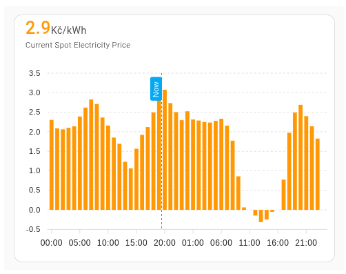

# Home Assistant Czech Energy Spot Prices

[](https://my.home-assistant.io/redirect/hacs_repository/?owner=rnovacek&repository=homeassistant_cz_energy_spot_prices&category=integration)

Home Assistant integration that provides current Czech electricity and gas spot prices based on [OTE](https://ote-cr.cz).

If this integration saves (or earns) you some money, you can [buy me a coffee ☕](https://github.com/sponsors/rnovacek).

## Features

- Provides real-time Czech electricity and gas spot prices from [OTE](https://ote-cr.cz).
- Supports both **60-minute** and **15-minute** electricity spot intervals (15-minute prices are available since OTE introduced them).
- Supports multiple currencies (EUR, CZK) and energy units (kWh, MWh).
- Configurable templates for buy/sell prices, including VAT and distribution fees.
- Includes sensors for monitoring current, cheapest, and most expensive electricity prices.
- Configurable binary sensors for lowest- and highest-priced **consecutive blocks or independent intervals**, including today, tomorrow, and chosen time windows.
- Persists last downloaded prices across Home Assistant restarts so sensors are available immediately on startup.
- Compatible with Home Assistant automations for energy optimization.

### Multiple instances

You can add the integration multiple times to combine commodities and intervals, for example:

- one instance for 60-minute electricity spot prices,
- another instance for 15-minute electricity spot prices,
- another instance for gas spot prices.

Each instance is configured separately (currency, unit, buy/sell template, price block searches).

### Important note

OTE (Czech market operator) uses hourly prices indexed from `1`, where:

- `1` (first hour of the day) corresponds to `00:00 - 01:00`.
- It does **not** mean `01:00 - 02:00`, as one might expect.

Keep this in mind when comparing prices reported by this integration with other sources (e.g., OTE, your electricity provider/distributor).

## Screenshot

See [Displaying a chart](#displaying-a-chart) for details.



## Buy and sell prices

The integration shows just spot prices by default. If you want to also use actual prices for buying and selling (so including distribution fees, VAT, etc), you need to configure it. Use the "Configure" button in integration details and set templates for buying/selling.

Variables for **electricity** templates:
- `value` — base spot price for the given interval (hourly or 15min, depending on configuration).
- `hour` — datetime of the interval being computed. The value is in **UTC**; if you need the local time (e.g. for tariff windows), use `as_local(hour)`.

Variables for **gas** templates (gas has only daily prices):
- `value` — base spot price for the day.
- `day` — date of the price (in UTC).

If you do not enter a template, the corresponding buy/sell sensors are not created.

### Example templates

**Electricity cost when buying**

```jinja










  


{{ (value + distrib_kWh + tax_kWh + oze_kWh + system_services_kWh + operator_cost_kWh) * ( 100.0 + vat_percent ) / 100.0 }}
```

**Electricity cost when selling**

```jinja

{{ value - operator_cost_kWh }}
```

**Gas cost when buying**

```jinja





{{ (value + distrib_kWh + tax_kWh + operator_cost_kWh) * (100.0 + vat_percent) / 100.0 }}
```

## Installation

You can install the integration using HACS (preferred) or manually.

### HACS (preferred)

1. Open HACS in your Home Assistant instance.
2. Search for "Czech Energy Spot Prices" and install it.
3. Restart Home Assistant.

### Manual

1. Download the `custom_components/cz_energy_spot_prices` directory.
2. Copy it into the `custom_components` folder in your Home Assistant configuration directory.
3. Restart Home Assistant.

### Add and configure the integration

1. Go to **Settings** -> **Devices & Services** -> **Add integration**.
2. Search for "Czech Energy Spot Prices" and select it.
3. Pick the **commodity** (electricity or gas), **currency** and **energy unit**. For electricity you will also be asked to choose the **interval** (60 minutes or 15 minutes).
4. (Optional) Use **Configure** to set templates for buy/sell prices. To create a price block search, open the integration page and choose **Add price block search** (see [Price block searches](#price-block-searches)).
5. (Optional) Repeat the steps to add another instance for a different commodity or interval (see [Multiple instances](#multiple-instances)).

## Sensors

The integration provides several sensors to monitor electricity/gas prices and related data. Below is a list of available sensors and their attributes.

Current electricity and gas price sensors support Home Assistant long-term statistics and can be used in the Statistics Graph card. Statistics are collected from the time the integration version containing this support is installed; existing history is not backfilled. For electricity, the graph shows the historical state of the current-price sensor, not the future prices exposed in its attributes.

### Electricity sensors

When the 15-minute interval is selected, the same sensors are also created with the `_15min` suffix in their entity id (e.g. `sensor.current_spot_electricity_price_15min`).

| Sensor | value | attributes |
| ------ | ----- | ---------- |
| **Current Spot Electricity Price** | electricity price for current interval (hour or 15 minutes) | dictionary with timestamps as keys and spot price for given interval as values |
| **Spot Cheapest Electricity Today** | price of the cheapest electricity today | [At](#at)<br>[Hour](#hour) |
| **Spot Most Expensive Electricity Today** | price of the most expensive electricity today | [At](#at)<br>[Hour](#hour) |
| **Spot Cheapest Electricity Tomorrow** | price of the cheapest electricity tomorrow | [At](#at)<br>[Hour](#hour) |
| **Spot Most Expensive Electricity Tomorrow** | price of the most expensive electricity tomorrow | [At](#at)<br>[Hour](#hour) |
| **Current Spot Electricity Hour Order** | order of current interval when we sort intervals by their price (1=cheapest, N=most expensive; N=24 for hourly, 96 for 15min) | dictionary with timestamps as keys and `[order, price]` as values |
| **Tomorrow Spot Electricity Hour Order** | no value | dictionary with timestamps as keys and `[order, price]` as values |
| **Spot Electricity Has Tomorrow Data** | `On` when data for tomorrow are loaded, `Off` otherwise (created only once for all electricity instances) | |
| **Spot Electricity Is Cheapest** | `On` when current interval has the cheapest price of the day, `Off` otherwise | [Start](#start)<br>[Start hour](#start-hour)<br>[End](#end)<br>[End hour](#end-hour)<br>[Min](#min)<br>[Max](#max)<br>[Mean](#mean) |
| **Spot/Buy/Sell Price Block Search** | `On` during the selected lowest- or highest-price block or independent intervals (one binary sensor per configured search) | [Start](#start)<br>[Start hour](#start-hour)<br>[End](#end)<br>[End hour](#end-hour)<br>[Min](#min)<br>[Max](#max)<br>[Mean](#mean)<br>[Intervals](#selection-modes) (independent mode only) |

If you configure templates for buy and sell prices, there will also be similar `Buy *` and `Sell *` sensors with the same structure.

### Gas sensors

Gas prices are published once per day, so gas sensors are simpler than the electricity ones.

| Sensor | value | attributes |
| ------ | ----- | ---------- |
| **Current Spot Gas Price** | gas spot price for today | |
| **Tomorrow Spot Gas Price** | gas spot price for tomorrow (when available) | |
| **Spot Gas Has Tomorrow Data** | `On` when tomorrow's gas price is loaded, `Off` otherwise (created only once for all gas instances) | |

If you configure a buy template for gas, there will also be `Current Buy Gas Price` and `Tomorrow Buy Gas Price` sensors. Selling is not supported for gas.

## Common attributes

### At

timestamp when the cheapest hour starts

### Hour

hour with the cheapest electricity (`2` means that cheapest electricity is from `2:00` till `3:00` in timezone you've configured in Home Assistant)

### Start

timestamp when the selected price block starts

### Start hour

hour when the selected price block starts, available for 60-minute electricity intervals

### End

timestamp when the selected price block ends

### End hour

hour when the selected price block ends, available for 60-minute electricity intervals

### Min

minimal price in the selected price block

### Max

maximal price in the selected price block

### Mean

average (mean) price in the selected price block


## Price block searches

In addition to the always-present *Spot Electricity Is Cheapest* binary sensor (which marks the single cheapest interval of the day), you can create custom **consecutive price block or independent interval** searches for either the lowest or highest prices.

Open the **Czech Energy Spot Prices** integration page and choose **Add price block search**. If you have more than one electricity configuration, Home Assistant first asks which one the search belongs to. Choose the search period, then configure its name, price source, objective, selection mode, duration, and window times when applicable.

Each search is shown as a separate entry beneath its electricity configuration. Its headline summarizes the configured name, search period, objective, price source, and duration, with an additional label for independent intervals. Use the gear button beside it to reconfigure the search, or its menu to rename or delete it. Each search creates one binary sensor. The sensor turns `On` only during the selected block or intervals, and its attributes contain the result:

- `Start` and `End`
- `Min`, `Max`, and `Mean` price of the selected intervals
- `Length hours`, `Price type`, `Objective`, and `Search type`

Fixed time-window searches are evaluated only when prices cover the complete configured window without gaps. An internal gap in an upcoming window also triggers fallback to the latest complete occurrence. Until an upcoming cross-midnight window is fully published, the sensor retains the latest fully evaluated occurrence and remains `Off` once that occurrence has ended.

For 60-minute electricity instances, the sensor also exposes `Start hour` and `End hour`. For 15-minute instances, the start and end timestamps are more precise than whole hours, so use `Start` and `End`.

### Selection modes

- **Continuous block** is the default and keeps the existing behavior: the device runs for the requested duration without gaps. Existing searches, entity IDs, attributes, and automations stay unchanged; no reconfiguration is needed after upgrading.
- **Independent intervals** selects exactly enough of the lowest- or highest-priced intervals to meet the requested duration. The intervals need not be adjacent. For example, a duration of `1 h` with 15-minute prices selects exactly four intervals; with 60-minute prices it selects one. Equal-price intervals are selected in chronological order, including when prices are zero or negative.

In independent mode, the binary sensor turns `Off` in gaps between selected intervals. `Length hours` is the total selected running time, not the elapsed time between the first start and last end. The additional `Intervals` attribute lists every selected interval as a mapping with `Start` and `End` timestamps in your Home Assistant timezone, and `Search mode` is `independent`. The top-level `Start` and `End` (and `Start hour`/`End hour`) mark only the outer boundaries: use the binary state or `Intervals` for automation, not that entire range. `Min`, `Max`, and `Mean` exclude the gaps.

Both modes use the full configured search period, including already elapsed intervals, and require complete prices for that period. The existing rules for missing tomorrow prices and cross-midnight fallback are unchanged. The new mode does not track actual device running time or compensate for a device started after a selected interval has passed.

### Search periods

The **Search period** decides where the integration is allowed to look for the price block:

| Search period | What it means | Good for |
| ----- | ------------- | -------- |
| **Today** | Finds the selected price block between midnight and midnight today. | A device that must run today, for example a dishwasher, washing machine, dryer, or daytime water heating cycle. |
| **Tomorrow plan** | Finds the selected price block in tomorrow's prices. The binary sensor stays `Off`; its attributes show the planned block after tomorrow's prices are published by OTE. | Planning ahead, for example pre-scheduling an EV charge, night storage heater, or heat pump boost for tomorrow. |
| **Time window** | Finds the selected price block between the configured start and end times. If the end time is earlier than the start time, the window continues after midnight. | Night-only loads, for example charging an EV only between `22:00` and `06:00`, or targeting high-price export periods. |

Choose the **Find** objective according to the automation:

- **Lowest price** selects the block or independent intervals with the lowest total price, normally used for consumption.
- **Highest price** selects the block or independent intervals with the highest total price, useful for export, battery discharge, or avoiding consumption. Equal-price results choose the earliest block or intervals.

Choose the **Price source** according to the decision you are automating:

- **Spot** uses raw spot market prices.
- **Buy** uses your buy template, including VAT, distribution, high/low tariff logic, and other fees.
- **Sell** uses your sell template, useful when deciding when not to consume solar energy or when to export instead of charge.

For most household automations that turn devices on, **Buy** is usually the right price type if you configured a buy template. It reflects what you actually pay, not only the market price.

### Real-world examples

**Heat water during the four cheapest quarter-hours**

On a 15-minute electricity configuration, create a search with **Today**, **Lowest price**, **Independent intervals**, duration **1 h**, and price source **Buy** (or **Spot** if no buy template is configured). This selects four quarter-hours anywhere in the day, not necessarily consecutive. Use the binary sensor's `On` state to enable the heater and its `Off` state to disable it. A fixed time window can restrict the same search, for example to `22:00` through `06:00`.

**Run a dishwasher during the cheapest 2 hours today**

Create a search:

- Name: `Dishwasher today`
- Search period: `Today`
- Find: `Lowest price`
- Duration: `2 h`
- Price source: `Buy`

Then use the created binary sensor as the condition or trigger for the dishwasher smart plug:

```yaml
alias: Dishwasher during cheapest block
trigger:
  - platform: state
    entity_id: binary_sensor.buy_cheapest_block_dishwasher_today
    to: "on"
action:
  - service: switch.turn_on
    target:
      entity_id: switch.dishwasher
mode: single
```

**Charge an EV overnight, but only in the cheapest 4 hours**

Create a search:

- Name: `EV overnight`
- Search period: `Time window`
- Find: `Lowest price`
- Window starts: `22:00`
- Window ends: `06:00`
- Duration: `4 h`
- Price source: `Buy`

The window may cross midnight, so this works for the common case where the car should only charge overnight:

```yaml
alias: EV cheapest overnight charging
trigger:
  - platform: state
    entity_id: binary_sensor.buy_cheapest_block_ev_overnight
action:
  - choose:
      - conditions:
          - condition: state
            entity_id: binary_sensor.buy_cheapest_block_ev_overnight
            state: "on"
        sequence:
          - service: switch.turn_on
            target:
              entity_id: switch.ev_charger
    default:
      - service: switch.turn_off
        target:
          entity_id: switch.ev_charger
mode: single
```

**Top up a home battery during a daytime price dip**

Create a search:

- Name: `Battery afternoon`
- Search period: `Time window`
- Window starts: `12:00`
- Window ends: `20:00`
- Duration: `2 h`
- Price source: `Buy`

This is useful when the battery can charge during the afternoon or evening, but you want to avoid the most expensive part of that window:

```yaml
alias: Battery charge during cheapest afternoon block
trigger:
  - platform: state
    entity_id: binary_sensor.buy_cheapest_block_battery_afternoon
action:
  - choose:
      - conditions:
          - condition: state
            entity_id: binary_sensor.buy_cheapest_block_battery_afternoon
            state: "on"
        sequence:
          - service: switch.turn_on
            target:
              entity_id: switch.battery_charging
    default:
      - service: switch.turn_off
        target:
          entity_id: switch.battery_charging
mode: single
```

**Prepare tomorrow's heating boost**

Create a search:

- Name: `Heating tomorrow`
- Search period: `Tomorrow plan`
- Duration: `3 h`
- Price source: `Buy`

Use it for devices that can be scheduled after tomorrow's prices are known, such as a heat pump boost or storage heater. The binary sensor stays off, but its `Start`, `End`, `Min`, `Max`, and `Mean` attributes show the cheapest 3-hour block planned for tomorrow.

### Upgrading from older versions

Older versions used a comma-separated *Cheapest consecutive hour blocks* option such as `2, 4, 8`. Existing configurations are migrated to named searches automatically. The old `2` hour length becomes searches like `Today 2h` and `Tomorrow 2h`, so existing users keep the same practical coverage while gaining editable names, search periods, and price sources.


## Displaying a chart


If you want to display a chart with current day (or two days if it's after noon), you can install [apexcharts-card](https://github.com/RomRider/apexcharts-card) card for Home Assistant and then use following config for it:

```yaml
type: custom:apexcharts-card
header:
  show: true
  show_states: true
  colorize_states: true
  title: Nákupní cena (15 min)
graph_span: 1d
span:
  start: day
now:
  show: true
  label: Nyní
  color: "#ff0000"
series:
  - entity: sensor.current_buy_electricity_price_15min
    name: Cena
    float_precision: 2
    type: line
    curve: stepline
    stroke_width: 2
    show:
      in_header: raw
    color_threshold:
      - value: -10
        color: "#00cc00"
      - value: 0
        color: "#ffaa00"
      - value: 4
        color: "#ff0000"
    data_generator: |
      return Object.entries(entity.attributes)
        .filter(([key, _]) => !isNaN(Date.parse(key)))
        .map(([date, value]) => {
          return [new Date(date).getTime(), value];
        });
```

## Find cheapest hours in selected interval

This is useful for example if you want to turn on your water heater in the afternoon and then again during the night.

### How It Works
- Define intervals as tuples `(start_hour, end_hour)` (end hour is excluded).
- The sensor will return `True` if the current hour is the cheapest in any of the defined intervals.
- Alternatively, replace the last line with `{{ min.cheapest_hours }}` to display the cheapest hours.

### Example Template Sensor

```jinja
{# Define your intervals here as tuples (hour starting the interval, hour ending the interval (excluded)) #}


{# We need to use namespace so we can write into it in inner cycle #}





  {# Reset min price from previous runs #}
  

  {# Go through all the hours in the interval (end excluded) and find the hour with lowest price #}
  
     {# Get datetime of current hour in current interval #}
     

     {# Get value for that hour #}
     

     {# Skip if not found #}
     
       
     

     {# value is tuple (order, price), we'll use the price #}
     

     {# Min price is not set or is higher than price of current hour => store the min price and hour #}
     
        
        
     
  

  {# Store cheapest hour in current interval #}
  


{# use this to get the cheapest hours #}
{# {{ min.cheapest_hours }} #}

{# return True if current hour is in the cheapest hour of any interval #}
{{ now().hour in min.cheapest_hours }}
```

## Example automation for X cheapest hours

This automation turns on a device (e.g., a heater) during the cheapest `X` hours of the day. Replace `X` with the desired number of hours and specify the entity to control.


```yaml
alias: Turn on for cheapest X hours
trigger:
  - platform: state
    entity_id:
      - sensor.current_spot_electricity_hour_order
condition: []
action:
  - if:
      - condition: numeric_state
        entity_id: sensor.current_spot_electricity_hour_order
        below: X # Replace with amount of hours you want to have it on
    then:
      - type: turn_on
        entity_id: # Add entity you want to turn on
    else:
      - type: turn_off
        entity_id: # Turn off the entity when cheapest interval ends
    enabled: true
mode: single
```

## License

This integration is under [Apache 2.0 License](./LICENSE.txt), the same license as Home Assistant itself.
